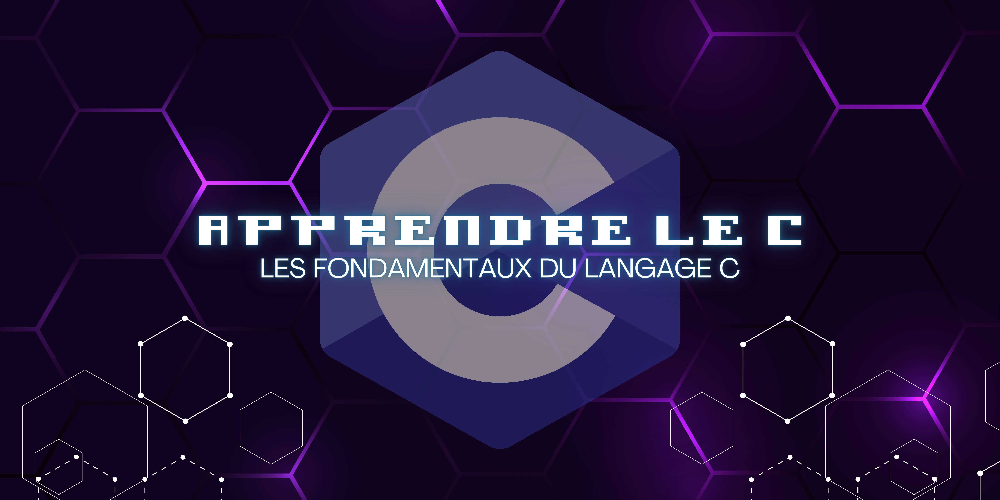

# Apprendre le C

<figure><figcaption>
Apprendre le C — Les fondamentaux du langage C
</figcaption></figure>

<figure><figcaption>
Apprendre le C — Franck FERMAN
</figcaption></figure>


## \[**TLP**:**CLAIR**] (_DIFFUSION PUBLIQUE_)

Le présent document est la propriété exclusive de M. [**Franck FERMAN**](https://github.com/franckferman) et est classé **TLP**:**CLAIR**, autorisant ainsi une diffusion étendue et publique, sous réserve du respect des règles de droit d'auteur standard.

Les informations contenues dans ce document sont déclarées non sensibles et peuvent être librement partagées ou diffusées publiquement sans nécessité de mesures de protection spécifiques.



## \[GNU Affero General Public License v3.0] (**GNU AGPLv3.0)**

Le présent document, un projet de documentation et d'apprentissage du langage C, est distribué sous la licence **GNU Affero General Public License v3.0** (**GNU AGPLv3.0**).

Conformément aux termes de cette licence, vous êtes autorisé à utiliser, étudier, modifier et distribuer cette documentation et les exercices inclus. En cas de modification de ce matériel, vous êtes tenu de rendre ces modifications accessibles aux utilisateurs finaux, sous une forme qui permet une utilisation, une étude, une modification et une distribution équivalentes. Cette obligation s'applique que les modifications soient effectuées pour un usage personnel ou comme partie intégrante d'un service en ligne.

Pour plus d'informations sur la licence GNU Affero General Public License v3.0, vous pouvez consulter le lien suivant : [GNU AGPLv3.0](https://www.gnu.org/licenses/agpl-3.0.html)

"_**Apprendre le C**_" is a project initiated by Mr. **Franck FERMAN** with the aim of introducing the fundamentals of the C language. It provides clear explanations and practical examples to help learners master the basics of C programming.

_Copyright (C) 2023 Franck FERMAN_

This program is free software: you can redistribute it and/or modify it under the terms of the GNU Affero General Public License as published by the Free Software Foundation, either version 3 of the License, or (at your option) any later version.

This program is distributed in the hope that it will be useful, but WITHOUT ANY WARRANTY; without even the implied warranty of MERCHANTABILITY or FITNESS FOR A PARTICULAR PURPOSE. See the GNU Affero General Public License for more details.

You should have received a copy of the GNU Affero General Public License along with this program. If not, see [https://www.gnu.org/licenses/](https://www.gnu.org/licenses/).


_Ce document a été créé le 05/04/2023 à Saint-Quentin-en-Yvelines (78180) par M. Franck FERMAN. Il s'agit d'un document évolutif qui peut être sujet à des modifications et révisions ultérieures._

Les commentaires sur le présent document sont à adresser à :

> _M. Franck FERMAN_
>
> Adresse électronique : [_fferman@protonmail.ch_](mailto:fferman@protonmail.ch)
