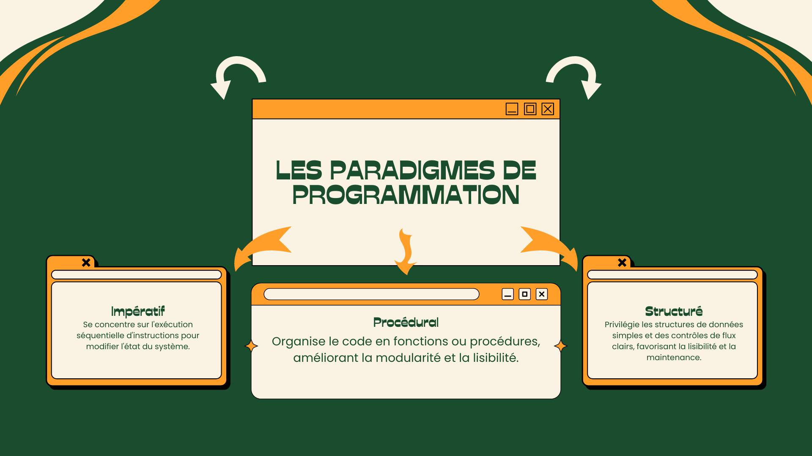

# 🖥 Caractéristiques générales du C

## **Paradigmes de programmation adoptés**

Le langage C adopte des paradigmes de programmation impératif, procédural, et structuré.

### **Paradigme de programmation impérative et déclarative**

La programmation impérative est un style de programmation où les instructions sont formulées de manière explicite pour déterminer les actions à réaliser par l'ordinateur, et ce, dans un ordre précis. Ces directives sont exécutées dans la séquence dans laquelle elles sont formulées, offrant au programmeur une maîtrise stricte sur le comportement de l'ordinateur. Ce paradigme se fonde sur le modèle de la machine de Turing, intrinsèque à l'architecture de la majorité des ordinateurs contemporains.

En effet, la majorité des processeurs employés dans les ordinateurs modernes opèrent suivant une logique impérative. Leur fonctionnement se résume à l'exécution d'une séquence d'instructions élémentaires, exprimées en opcodes (codes opérationnels), qui constituent le langage machine propre à l'architecture du processeur. À tout instant, l'état du programme est déterminé par le contenu de la mémoire principale.

```
Opérations :
1. Charger la valeur de A dans le registre R1
2. Ajouter la valeur de B au registre R1
3. Stocker la valeur de R1 dans C

   +-----------------------+
   | Processeur impératif   |
   +-----------------------+
   | Charger A dans R1     |
   | Ajouter B à R1        |
   | Stocker R1 dans C     |
   +-----------------------+
```

Ainsi, dans la programmation impérative, l'état du programme à un moment donné est défini par le contenu de la mémoire centrale à cet instant précis. Chaque instruction modifie cet état. Un exemple typique d'instruction dans un langage de bas niveau est un opcode (operation code), un mot clé ou symbole signalant au processeur l'opération à réaliser. Par exemple, l'instruction ADD dans l'assembleur x86 effectue une addition.

| Code source en C | Code assembleur correspondant                                                       |
| ---------------- | ----------------------------------------------------------------------------------- |
| `arg1 += arg2;`  | `add rsi, rdi`                                                                      |
| `arg1 = arg2;`   | `mov rsi, rdi`                                                                      |
| `arg1 *= 2;`     | `sal rdi, 1`                                                                        |
| `arg2 /= 3;`     | <p><code>mov rsi, 3</code><br><code>xor rax, rax</code><br><code>div rsi</code></p> |

La programmation impérative est la pierre angulaire de nombreux langages de haut niveau, introduisant des notions plus évoluées comme les variables et les structures de contrôle. La plupart des langages de programmation modernes, y compris Fortran, Java, C et C++, ont adopté ce paradigme. Il se différencie de la programmation déclarative, où les instructions dépeignent le résultat escompté, plutôt que la manière de l'atteindre.

Effectivement, la programmation déclarative consiste à rédiger des instructions qui décrivent ce que l'on souhaite accomplir, plutôt que de spécifier comment le faire. La programmation déclarative est souvent perçue comme plus intuitive et plus aisée à comprendre que la programmation impérative, car elle se focalise sur ce que le code fait, plutôt que sur les détails de son fonctionnement interne.

Le concept de programmation impérative s'apparente à celui de suivre une recette de cuisine ou un processus industriel. Dans ce contexte, chaque étape est considérée comme une instruction, et le monde physique est considéré comme l'état modifiable. Étant donné que les principes fondamentaux de la programmation impérative sont à la fois familiers et directement intégrés dans l'architecture des microprocesseurs, la plupart des langages de programmation adoptent ce type de paradigme.

Pour illustrer la divergence entre programmation déclarative et programmation impérative, nous utiliserons deux exemples simples : le calcul de la somme des nombres pairs d'une liste d'entiers et la recherche de données dans une base de données.

**Exemple 1 : Calcul de la somme des nombres pairs**

**Impératif (Python)**

```python
def somme_nombres_pairs(liste_nombres):
    somme = 0
    for nombre in liste_nombres:
        if nombre % 2 == 0:
            somme += nombre
    return somme

liste_nombres = [1, 2, 3, 4, 5, 6, 7, 8, 9]
resultat = somme_nombres_pairs(liste_nombres)
print(resultat)
```

Dans cette approche impérative, chaque étape du calcul est explicitement définie. L'état initial est déclaré (somme = 0), puis une boucle parcourt la liste de nombres, et pour chaque nombre pair (si son reste après division par 2 est égal à zéro), celui-ci est ajouté à la somme. L'impératif ici est dans la description explicite du processus de calcul.

**Déclaratif (Haskell)**

```haskell
sommeNombresPairs :: [Int] -> Int
sommeNombresPairs listeNombres = sum (filter even listeNombres)

listeNombres = [1, 2, 3, 4, 5, 6, 7, 8, 9]
resultat = sommeNombresPairs listeNombres
print resultat
```

Dans cette approche déclarative, le calcul est exprimé sans l'explicitation de chaque étape. Les fonctions `filter` et `sum` sont employées pour obtenir une liste de nombres pairs, puis calculer leur somme. L'intention du "quoi" (la somme des nombres pairs) est mise en avant plutôt que le "comment" (le filtrage et l'addition).

Ces deux exemples mettent en exergue les différences entre la programmation impérative et déclarative. L'impérative fournit une séquence détaillée d'instructions pour obtenir le résultat, tandis que la déclarative décrit le résultat souhaité, laissant les détails du "comment" au système d'exécution.

**Exemple 2 : Recherche de données dans une base de données**

**Impératif (Python)**

```python
import sqlite3

conn = sqlite3.connect('ma_base_de_donnees.db')
curseur = conn.cursor()

curseur.execute("SELECT nom, prenom FROM utilisateurs WHERE age > 18")
resultats = curseur.fetchall()

for resultat in resultats:
    print(resultat)

conn.close()
```

Cet exemple en Python est impératif. Il spécifie chaque étape de la requête, incluant l'ouverture et la fermeture de la connexion à la base de données, l'exécution de la requête SQL et la gestion des résultats.

**Déclaratif (SQL)**

```sql
SELECT nom, prenom FROM utilisateurs WHERE age > 18
```

Cette requête SQL est déclarative. Elle se focalise sur la description de l'information souhaitée, laissant le système de gestion de base de données se charger des détails de comment obtenir ces informations.

**Déclaratif (Haskell)**

```haskell
import Database.HDBC.Sqlite3 (connectSqlite3, Connection)
import Database.HDBC (runRaw, quickQuery')

trouverUtilisateurs :: Int -> IO [[String]]
trouverUtilisateurs age = do
    conn <- connectSqlite3 "ma_base_de_donnees.db"
    let requete = "SELECT nom, prenom FROM utilisateurs WHERE age > ?"
    resultats <- quickQuery' conn requete [toSql age]
    return resultats
```

Ce code Haskell est également déclaratif, utilisant des fonctions pour interagir avec la base de données. Il offre un certain niveau d'abstraction en cachant certains détails d'implémentation tout en offrant plus de contrôle comparé à l'exemple SQL.

Pour les trois exemples ci-dessus, la tâche consiste à chercher les noms et prénoms des utilisateurs dont l'âge est supérieur à 18 ans dans une base de données. Le code Python, de nature impérative, requiert une séquence d'étapes détaillées comme l'ouverture de la connexion, la création d'un curseur, l'exécution de la requête SQL, la récupération des résultats et la fermeture de la connexion.

Le code SQL, par contre, est déclaratif : il définit la requête pour extraire les données sans s'embarrasser des détails techniques.

Enfin, le code Haskell, également déclaratif, utilise des fonctions pour interagir avec la base de données, offrant une plus grande flexibilité et un meilleur contrôle que la simple requête SQL.

**Analogie : Préparer une tasse de thé**

Si l'on devait préparer une tasse de thé, une approche impérative dicterait toutes les étapes nécessaires à la préparation :

```markdown
1. Trouver une tasse propre.
2. Placer un sachet de thé dans la tasse.
3. Faire bouillir de l'eau.
4. Verser l'eau bouillante dans la tasse avec le sachet de thé.
5. Laisser infuser pendant environ 3 minutes.
6. Retirer le sachet de thé.
7. Ajouter du sucre et du lait selon les préférences.
```

Dans une approche déclarative, on pourrait simplement décrire le résultat final souhaité sans préciser comment l'atteindre. Par exemple :

```markdown
- J'aimerais une tasse de thé avec un peu de sucre et du lait.
```

La programmation déclarative se concentre sur le résultat escompté, laissant le soin aux abstractions et aux outils sous-jacents de déterminer les détails spécifiques de la mise en œuvre pour atteindre ce résultat.

### **Les paradigmes procédural et structuré**

* **Procédural** : La programmation procédurale repose sur le paradigme impératif. Elle consiste à structurer le code en procédures, ou fonctions, qui sont des suites d'instructions ordonnées exécutées successivement, de haut en bas. Les fonctions regroupent des instructions liées entre elles, ce qui améliore la lisibilité et la modularité du code, et facilite son débogage. En C, cette approche est utilisée de manière extensive.

```c
#include <stdio.h>

// Déclarations de prototypes des fonctions
int addition(int a, int b);
void afficherResultat(int resultat);
void effectuerOperation(int x, int y);

// Fonction main (point d'entrée du programme)
int main()
{
    int a = 5;
    int b = 3;

	// Appel de la fonction effectuerOperation pour effectuer une opération
    effectuerOperation(a, b);

    return 0;
}

// Définition des fonctions

// Fonction qui calcule la somme de deux entiers
int addition(int a, int b)
{
    return a + b;
}

// Fonction qui affiche le résultat d'une opération
void afficherResultat(int resultat)
{
    printf("Le résultat est : %d\n", resultat);
}

// Fonction qui effectue une opération en utilisant les deux fonctions précédentes
void effectuerOperation(int x, int y)
{
    int somme = addition(x, y);
    afficherResultat(somme);
}
```

* **Structuré** : Le paradigme structuré, qui est également un sous-ensemble de l'impératif, met l'accent sur la création de structures de données claires et simples, et sur la gestion du flux du programme. Il favorise l'utilisation de blocs logiques comme les boucles et les instructions conditionnelles pour diriger le flux d'exécution, améliorant ainsi la lisibilité et la maintenabilité du code. Dans le langage C, les structures de contrôle comme les boucles `for`, `while` et `do...while` ainsi que les instructions conditionnelles `if...else` illustrent ce paradigme.

**Exemple d'utilisation de structures de données et de boucles `for` pour effectuer une opération sur un tableau d'entiers**

```c
#include <stdio.h>

#define SIZE 5

int main()
{
    int numbers[SIZE] = {1, 2, 3, 4, 5};
    int sum = 0;
    int i;

    // Boucle for pour calculer la somme des éléments du tableau
    for (i = 0; i < SIZE; i++)
    {
        sum += numbers[i];
    }

    printf("La somme des éléments du tableau est : %d\n", sum);

    return 0;
}
```

L'article fondateur de Dijkstra, "GO TO statement considered harmful", a grandement influencé le développement de la programmation structurée. Il mettait en exergue les problèmes causés par l'instruction `goto`, notamment la difficulté à suivre la logique du code et à le déboguer. La programmation structurée prône une organisation hiérarchique claire du code, souvent réalisée par le biais de structures de contrôle telles que `while`, `repeat`, `for`, `if..then..else`. Elle recommande aussi un unique point d'entrée et de sortie pour chaque boucle, une règle appliquée par certains langages de programmation.

**Exemple d'utilisantion d'instructions `goto`**

```c
#include <stdio.h>

#define SIZE 5

int main()
{
    int numbers[SIZE] = {1, 2, 3, 4, 5};
    int sum = 0;
    int i = 0;

    goto loop_start;

loop_start:
    if (i >= SIZE)
        goto loop_end;

    sum += numbers[i];
    i++;
    goto loop_start;

loop_end:
    printf("La somme des éléments du tableau est : %d\n", sum);

    return 0;
}
```

L'utilisation d'instructions `goto` rend le code moins lisible, moins prévisible et plus difficile à comprendre et à maintenir. Les instructions `goto` cassent la structure naturelle du code et rendent la logique du programme plus complexe à suivre.

En résumé, les paradigmes de programmation impératif, procédural et structuré sont des approches complémentaires permettant d'organiser et de structurer le code. Le paradigme impératif est axé sur les instructions, le paradigme procédural se concentre sur les fonctions et le paradigme structuré vise la mise en place de structures de données simples et de contrôles de flux efficaces.

<figure><figcaption><p>Les paradigmes de programmation</p></figcaption></figure>
