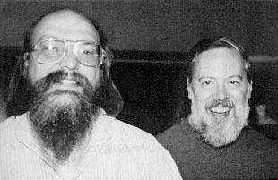
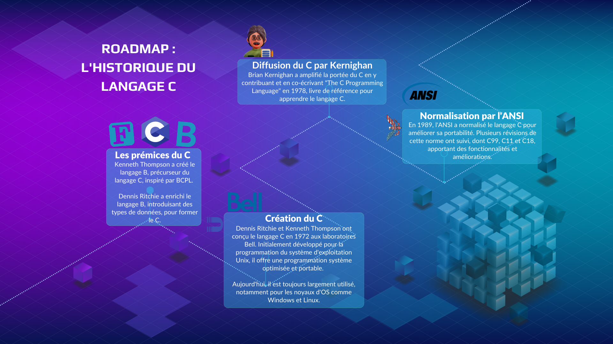

# I.1.1 Genèse et évolution

Créé en 1972 au sein des laboratoires Bell, le langage de programmation C est l'œuvre de Dennis Ritchie et Ken Thompson. Initialement dédié au développement du système d'exploitation Unix, son utilisation reste aujourd'hui prééminente dans le domaine de la programmation système. Par ailleurs, la plupart des noyaux des systèmes d'exploitation majeurs, comme Windows et Linux, sont principalement conçus en C.

<figure><figcaption>
<strong>Ken Thompson et Dennis Ritchie</strong> (1973), créateurs d'Unix et du langage C, figures emblématiques de l'informatique moderne.
</figcaption></figure>

Avant l'essor du langage C, les systèmes étaient principalement codés en langage assembleur, un processus à la fois complexe et laborieux. Le langage C, de par sa simplicité relative, a permis aux développeurs de concevoir des logiciels de manière plus efficiente et véloce. Il en découle que le langage C a progressivement conquis ses lettres de noblesse, aujourd'hui omniprésent, il s'est imposé comme une composante incontournable d'innombrables systèmes et applications.

Le langage B, développé par Ken Thompson, et fortement inspiré du BCPL, est le prédécesseur direct du C. Dennis Ritchie a par la suite élaboré une version suffisamment évoluée du langage B, en y intégrant des types de données, pour la distinguer comme un nouveau langage, baptisé C.

Ritchie reconnaissait que le C était une déclinaison du B, tout en mettant en exergue l'influence d'autres langages comme PL/I, FORTRAN et ALGOL 68. L'équipe de Ritchie était persuadée de la nécessité de programmer un système d'exploitation dans un langage de haut niveau, un concept innovant repris de Multics, codé en PL/I.

Brian Kernighan a joué un rôle clé dans la popularisation du langage C, en participant activement à son développement. Kernighan et Ritchie ont co-écrit "The C Programming Language" en 1978, un ouvrage qui décrit la version stabilisée du langage C et qui est fréquemment perçu comme le manuel de référence classique pour maîtriser ce langage.

En 1989, l'American National Standards Institute (ANSI) a standardisé le langage C, instaurant ainsi la norme ANSI C. Cette standardisation a engendré une compatibilité accrue du code entre diverses plateformes. Depuis, plusieurs révisions ont été apportées à la norme, comme C99, C11 et C18, enrichissant le langage de nouvelles fonctionnalités et améliorations.

Le langage C a également servi de socle à de nombreux autres langages de programmation tels que C++, C#, Objective-C, PHP, JavaScript, Perl et D. Ces langages ont enrichi les fonctionnalités du langage C, tout en conservant certaines de ses propriétés intrinsèques.

Pour conclure, le langage C a joué un rôle déterminant dans le développement de la programmation informatique et continue de jouir d'une large utilisation pour le développement de systèmes d'exploitation, d'applications embarquées et de logiciels de bas niveau.

<figure><figcaption>
<strong>Roadmap : Genèse et évolution du langage C</strong> — De ses origines avec le langage B à sa normalisation par l'ANSI, en passant par la création du langage C et sa diffusion grâce à Brian Kernighan.
</figcaption></figure>

