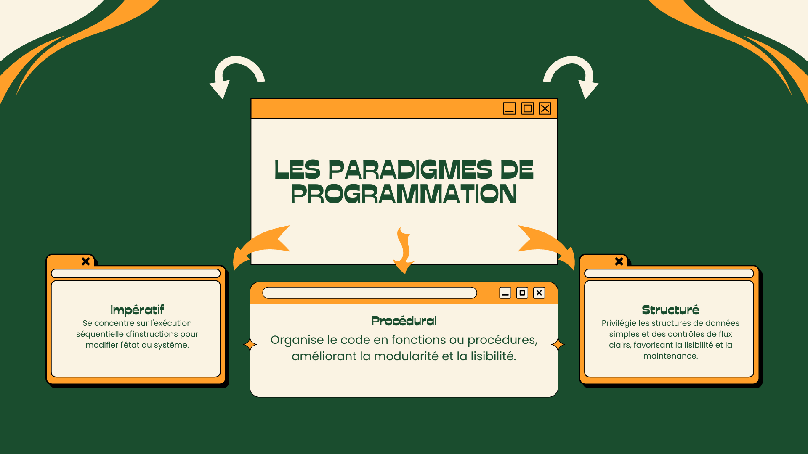

# Paradigmes de programmation adoptés

Le langage C intègre plusieurs paradigmes de programmation, notamment l'impératif, le procédural et le structuré.

<figure><figcaption>
<strong>Les paradigmes de programmation</strong> — Aperçu des approches impérative, procédurale et structurée, qui guident l'organisation et l'exécution du code pour améliorer lisibilité, modularité et maintenance.
</figcaption></figure>
